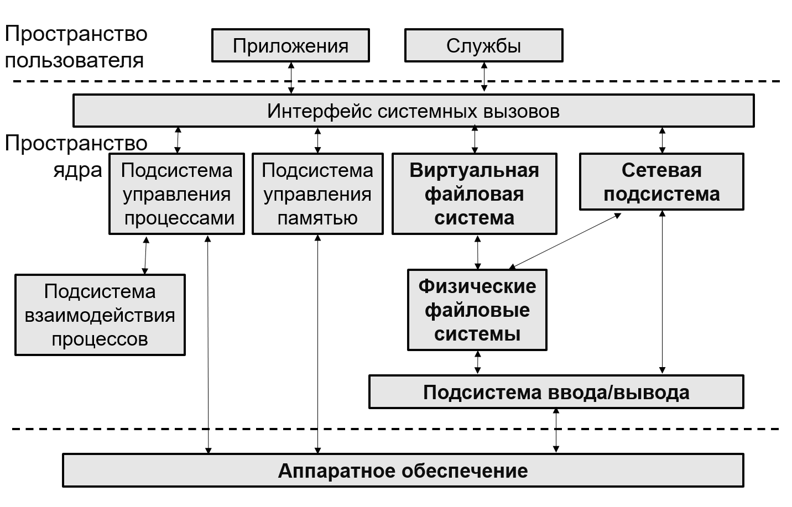

# Научно-исследовательская работа (НИРС) 

### Тема: **"Классификация сетевых подсистем мониторинга ядра ОС Linux"**

## Техническое задание (ТЗ)

Провести обзор подсистем мониторинга операционной системы Linux. 
Провести анализ работы данных подсистем и средств механизма сетевого мониторинга ядра Linux-систем, выявить средства мониторинга. 
Классифицировать существующие  подсистемы мониторинга и средств мониторинга.

- [Файл с ТЗ](https://github.com/Mansurow/bmstu-iu7-NIR/blob/master/РПЗ/ТЗ.pdf)
- [Файл с РПЗ](https://github.com/Mansurow/bmstu-iu7-NIR/blob/master/ИУ7-56Б_Мансуров_НИР3курса.pdf)
- [Презентация](https://github.com/Mansurow/bmstu-iu7-NIR/blob/master/presentation/main.pdf)

## Краткое описание работы

Целью работы является провести анализ существующих средств мониторинга сетевой подсистемы ядра ОС Linux.

Для достижения поставленной цели необходимо решить следующие задачи:
- провести анализ предметной области сетевой подсистемы ядра ОС Linux;
- провести обзор существующих подсистем и средств сетевого мониторинга ядра OC Linux
- сформулировать критерии сравнения средств сетевого мониторинга ядра;
- классифицировать существующие подсистемы и средства сетевого мониторинга.

### Анализ предметной области

В предметной области ядра ОС Linux были рассмотрены механизмы мониторинга:

- ядро Linux;
- подсистемы ядра Linux;
- сетевая подсистема ядра Linux;
- протоколы сети TCP/IP и OSI.

### Средства сетевого мониторинга  

В качетсве средств были рассмотрены следующие:
- утилиты для сетевого мониторинга;
- модификация кода ядра Linux; 
- зондирование ядра Linux;
- точки трассировки;
- function Trace;
- extended Berkeley Packet Filter.

### Критерии сравнения методов сетевого мониторинга

|Критерий|Описание|
|--------|----------|
|Производительность|Работа при реальной нагрузки и низкие расход системных ресурсов|
|Безопасность|Наличие гарантии, что внесенный код не вызовет сбой системы или нет необходимости к внедрению написанного код|
|Скорость разработки|Быстрота разработки программ для сетевого мониторинга|
|Работоспособность|Запуск на работающей системе без сбоев или требования перезапуска|
|Гибкость|Возможность выполнить любые поставленные задачи|
|Независимость|Независимость от сборки ядра|
|Простота развертывания|Насколько сложно развертывать средства мониторинга на машине и сопровождением документации|

### Сравнение методов сетевого монитори

|Критерий              |Утилиты|Модификация|kprobes|tracepoint|ftrace|BPF/eBPF|
|----------------------|-------|-----------|-------|----------|------|--------|
|Производительность    |+      |+/-        |+/-    |+         |+     |+       |
|Безопасность          |+      |-          |+/-    |+/-       |+     |+       |
|Скорость разработки   |НН     |-          |-      |+         |НН    |+       |
|Работоспособность     |+      |+/-        |+/-    |+/-       |+     |+       |
|Гибкость              |-      |-          |+      |+         |-     |-       |
|Независимость         |+/-    |-          |+/-    |+         |+     |+       |
|Простота развертывания|+      |+          |+/-    |+/-       |-     |+       |

- "+" - Метод сетевого мониторинга ядра Linux в реализации данного критерия полностью возможно.
- "НН" - Метод сетевого мониторинга не требует изменение или добавление пользовательского кода в ядро Linux.
- "-" - Метод сетевого мониторинга ядра Linux в реализации данного критерия полностью невозможна либо значительно осложнена в сравнении с остальными методами.
- "+/-" - Метод сетевого мониторинга ядра Linux в реализации данного критерия возможно, но осложнена

PS: Многие критерии являются более общенными и их нельзя подкрепить к каким-либо числовым признакам, поэтому необходимо привести к более техническому ввиду и прикрепиться источники, в которых проводились исследования и имеющие числовой признак для выше выдвинутых критерия.

### СПИСОК ИСПОЛЬЗОВАННЫХ ИСТОЧНИКОВ

**Электронные ресурсы:**
1. [Определение API](https://www.%20oxfordlearnersdictionaries.com/definition/english/api?q=API)
2. [Количество багов версий ядра](https://bugzilla.kernel.org/report.cgi?bug_status=NEW&bug_status=ASSIGNED&bug_status=REOPENED&cumulate=0&y_axis_field=cf_kernel_version&width=1024&height=600&action=wrap&format=table)
3. [Структура сокета](https://archive.kernel.org/oldlinux/htmldocs/networking/API-struct-socket.html)
4. [Мониторинг обработки IP-пакетов в ОС Linux](https://cyberleninka.ru/article/n/monitoring-obrabotki-ip-paketov-v-os-linux/viewer)
5. [Probing the Guts of Kprobes](https://landley.net/kdocs/ols/2006/ols2006v2-pages-109-124.pdf)
6. [Kernel Probes (Kprobes)](https://www.kernel.org/doc/html/latest/trace/kprobes.html)
7. [Using the Linux Kernel Tracepoints](https://www.kernel.org/doc/html/latest/trace/tracepoints.html)
8. [Declarative Tracepoints: A Programmable and Application Independent Debugging System for Wireless Sensor Networks](https://www.cs.virginia.edu/~stankovic/psfiles/tracepoints.pdf)
9. [ftrace - Function Tracer](https://www.kernel.org/doc/html/latest/trace/ftrace.html)

**Литература:**
1. Лора А. Чеппел Эд Титтел. TCP/IP: учебное пособие. — CанктПетербург: Издательство «БXВ-Петербург», 2003. С. 11 – 77.
2. О.И. Цилюрик. Модули Linux ядра: учебное пособие. — Казань: Казанский университет, 2011. С. 89 – 98.
3. Benvenuti C. Understanding Linux Network Internals. — Sebastopol: O’ReillyMedia, Inc., 2005. p. 1064.
4. Гостев И. М. Операционные системы : учебник и практикум для вузов, 2-е изд. — Москва: Издательство «Юрайт», 2022. с. 164.
5. Хант Крэйг. TCP/IP Сетевое администрирование 3-е издание. — СанктПетербург: Издательство «Симво», 2008. С. 18 – 42.
6. Rosen Rami. Linux Kernel Networking Implementation and Theory. — Apress: ISBN., 2014. с. 648.
7. Калавера Дэвид Фонтана Лоренцо. BPF для мониторинга Linux. — Cанкт-Петербург: Издательство «Питер», 2021. с. 208.
